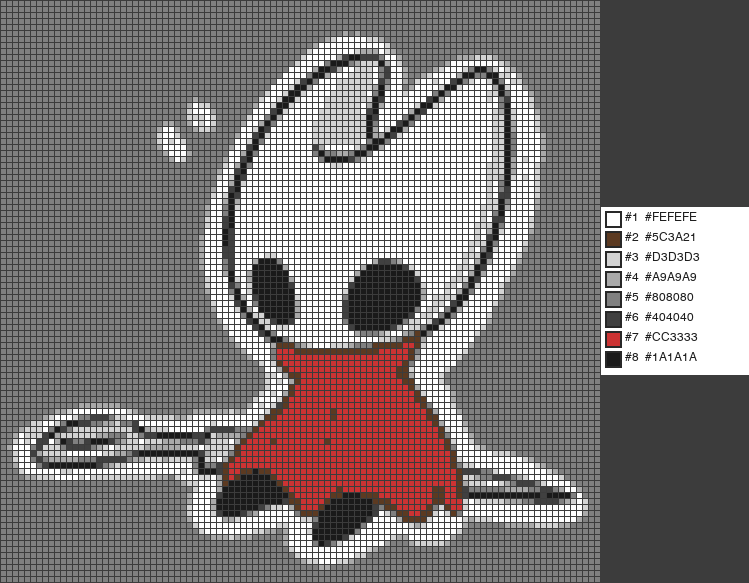

# 拼豆图案生成器（最简单！） · Fuse Beads Generator

上传任意图片，自动生成拼豆（Perler / Hama beads）图纸。每个格子里印有颜色编号，对照旁边的 **#RRGGBB** 色卡图例，直接照着拼就行。

**[打开网页 →](https://helotte.github.io/fuse-beads)**

## 预览

以《空洞骑士》Hornet 为例，50×48 拼豆，8 色调色板：



## 功能

- **真实拼豆色板** — 70+ 种基于 Perler / Hama / Artkal 常用颜色的固定色板，生成的颜色都能买到对应拼豆
- **自适应 k-means 取色** — 先对图片做 k-means 聚类，再吸附到最近的拼豆颜色，兼顾画面还原度和色彩实用性
- **格子内编号** — 每颗拼豆格子里印有颜色编号，和图例一一对应，不再需要凭肉眼比对颜色
- **#RRGGBB 图例** — 右侧色卡直接用六位 hex 码标注，方便去淘宝按色号购买
- **可调参数** — 画布宽度、颜色数量、拼豆大小、格子间距、是否显示编号

## 使用方式

### 网页版（推荐）

打开 [helotte.github.io/fuse-beads](https://helotte.github.io/fuse-beads)，上传图片，调好参数，点生成。结果可直接下载 PNG。

### 命令行版

```bash
# 编辑 fusing.py 里的参数，然后运行：
python fusing.py
```

`fusing.py` 配置项：

| 参数 | 含义 |
|------|------|
| `INPUT` | 输入图片路径 |
| `OUTPUT` | 输出图片路径 |
| `N_COLORS` | 颜色数量（3~40） |
| `WIDTH` | 画布宽度（拼豆数量） |
| `BEAD_SIZE` | 每颗拼豆的像素大小 |
| `GRID` | 格子间距（像素） |

## 技术栈

纯静态页面 — HTML · CSS · JavaScript · Canvas API，所有图片处理在浏览器本地完成，零依赖、零后端。Python 版本在 `beads.py` / `fusing.py` 中保留，供命令行使用。
